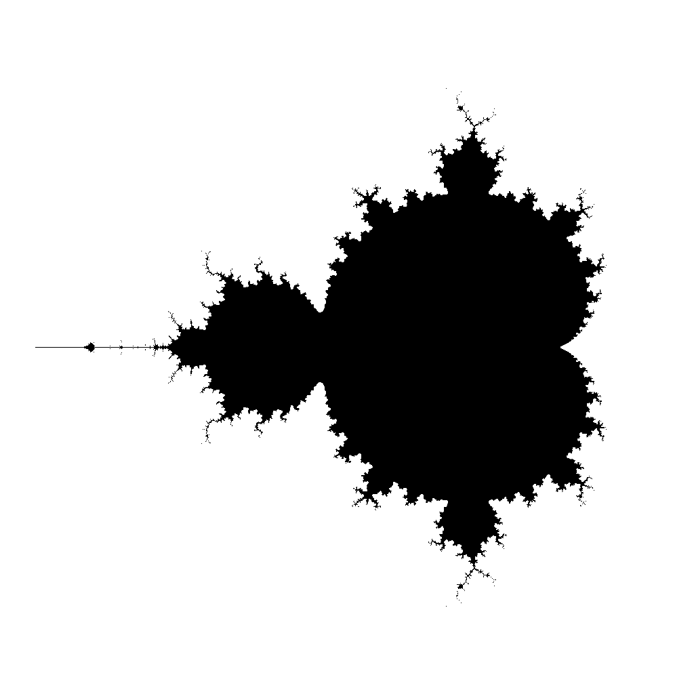
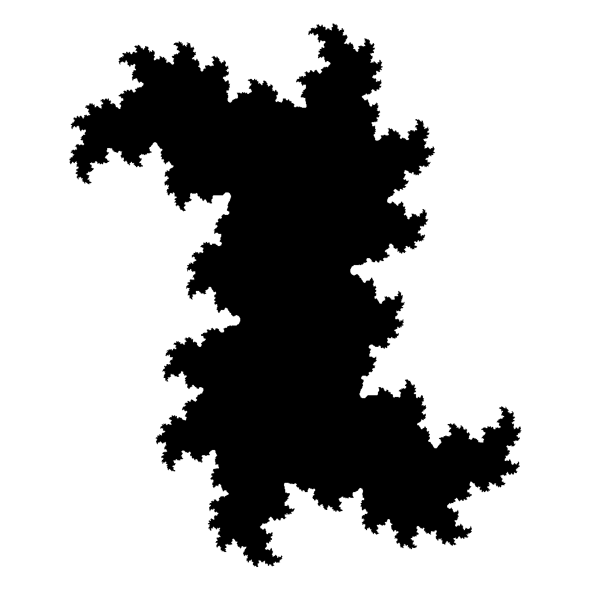
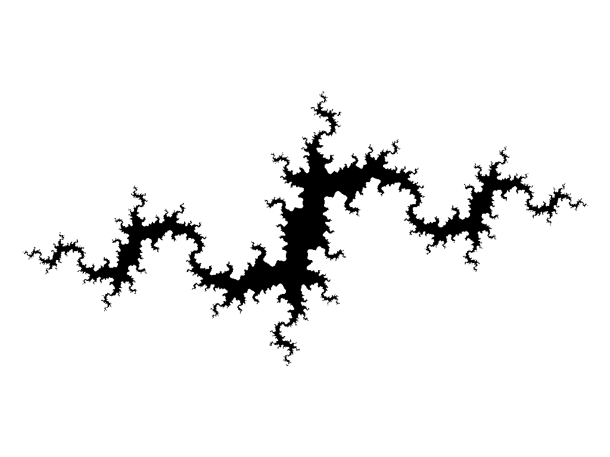

# Fractal Visualizer

Fractal visualizer renders [Mandelbrot Set] and [Julia Sets] using various visualizing techniques,
and produces bitmap image, vector image or a 3D mesh suitable for 3D printing.

## Prerequisites

Before you can use `fractal-visualizer` you have to download 
and install [Potrace], and add make sure it is in your [PATH].

To verify your Potrace installation is correct, run this command:

```shell
potrace -v
```

You should see output similar to this:

```
potrace 1.16. Copyright (C) 2001-2019 Peter Selinger.
Library version: potracelib 1.16
Default unit: inches
Default page size: lette
```

## Installation

```shell
python -m venv .venv
pip install -r requirements.txt
# Do this every time you change the terminal:
. venv/bin/activate
```

## Usage

```
> python fractal-visualizer.py -h
usage: fractal-visualizer [-h] [-d SIZE] [-vc VIEWPORT_CENTER VIEWPORT_CENTER] [-vw VIEWPORT_WIDTH] [-t {mandelbrot,julia}] [-p PARAMETER PARAMETER] [-m MAX_ITERATIONS] [-e ESCAPE_RADIUS] [-s] [-cm COLOR_MAP]

options:
  -h, --help            show this help message and exit
  -d SIZE, --dimensions SIZE
  -vc VIEWPORT_CENTER VIEWPORT_CENTER, --viewport-center VIEWPORT_CENTER VIEWPORT_CENTER
  -vw VIEWPORT_WIDTH, --viewport-width VIEWPORT_WIDTH
  -t {mandelbrot,julia}, --type {mandelbrot,julia}
  -p PARAMETER PARAMETER, --parameter PARAMETER PARAMETER
  -m MAX_ITERATIONS, --max-iterations MAX_ITERATIONS
  -e ESCAPE_RADIUS, --escape-radius ESCAPE_RADIUS
  -s, --smooth
  -cm COLOR_MAP, --color-map COLOR_MAP
```

## Interesting fractals

You can use this [Julia Set Explorer] to find appealing parameter.

### Mandelbrot set
```shell
python fractal-visualizer.py -vc -0.65 0 -vw 3
```


### Julia set with p = 0.75
```shell
python fractal-visualizer.py -d 1024x768 -t julia -p -0.75 0 -vw 3.5
```


### Julia set with p = 0.35+0.35i
```shell
python fractal-visualizer.py -t julia -p 0.35 0.35 -vw 3
```


### Julia set with p = -1-0.3i
```shell
python fractal-visualizer.py -d 1024x768 -t julia -p -1 -0.3 -vw 3.5
```


[Mandelbrot Set]: https://en.wikipedia.org/wiki/Mandelbrot_set
[Julia Sets]: https://en.wikipedia.org/wiki/Julia_set
[potrace]: https://potrace.sourceforge.net/#downloading
[PATH]: https://en.wikipedia.org/wiki/PATH_(variable)
[Julia Set Explorer]: https://complex-analysis.com/applets/p5js/julia/
